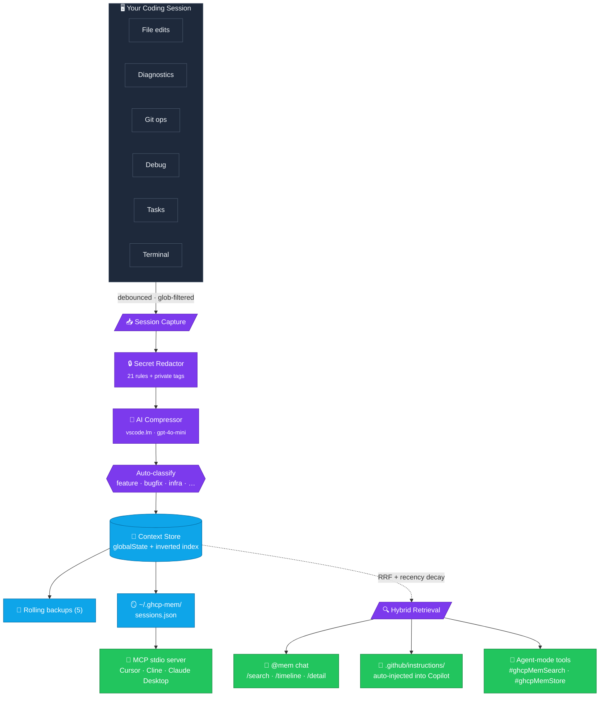
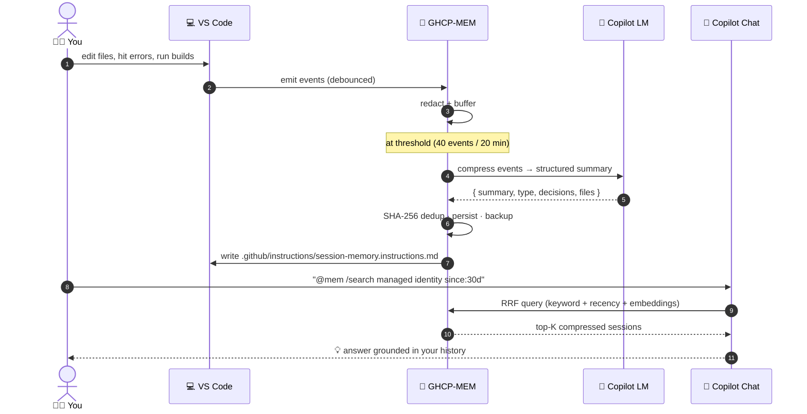
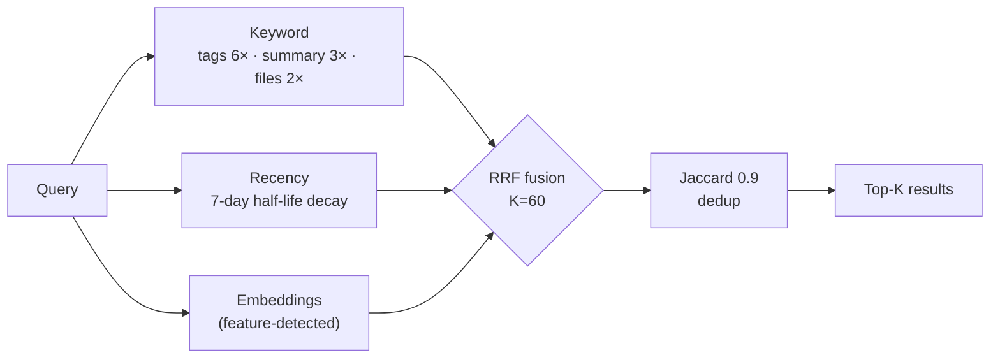
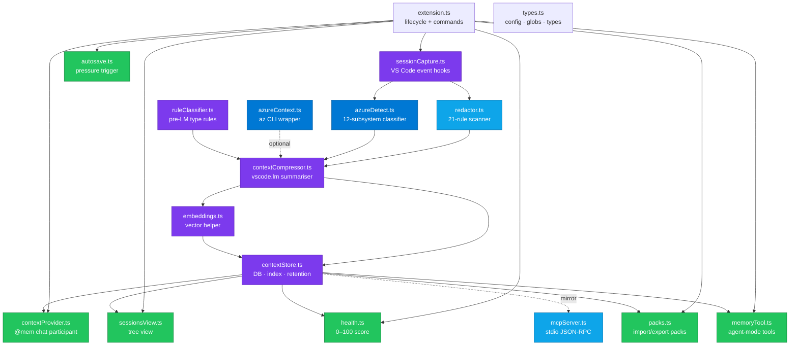

<div align="center">

# 🧠 GHCP-MEM

### Persistent memory for GitHub Copilot.
### Built for VS Code, the enterprise, and Azure.

**Zero dependencies · Zero network ports · Native MCP · Secret-redacted by default**

[](https://code.visualstudio.com/)
[](https://github.com/features/copilot)
[](https://modelcontextprotocol.io/)
[](#%EF%B8%8F-azure--enterprise)

[](LICENSE)
[](CHANGELOG.md)
[](src/test)
[](#-why-it-matters)
[](#-privacy--security)
[](#-privacy--security)
[](https://nodejs.org/)

</div>

---

## 🎯 What it is

**GHCP-MEM gives GitHub Copilot a persistent memory** across every session, file, and project — without spinning up a single sidecar, port, or native binary.

It captures what you actually do (edits, diagnostics, git, debug, tasks, terminal), compresses each session into a structured summary via the Copilot Language Model, scrubs secrets in a 21-rule dual-pass scanner, and quietly re-injects relevant prior context whenever you start a new conversation.

---

## 💡 Why it matters

Most "AI memory" tools were built for a single chat client and a single laptop. GHCP-MEM was built for **engineers who ship to production from VS Code** — often inside an enterprise, often on Azure, often on a machine with no admin rights, no Bun, no Python, and no open ports allowed.

<table>
<tr>
<td width="33%" align="center" valign="top">

### 🪶 Zero dependencies
No Bun. No uv. No Python. No SQLite binary. No WASM. No Chroma. No model downloads.

**Pure TypeScript on the VS Code API.**

</td>
<td width="33%" align="center" valign="top">

### 🔌 Zero network ports
Nothing listens. Nothing phones home. No `:37777`. No `localhost` HTTP worker.

**Air-gap friendly. Audit-friendly.**

</td>
<td width="33%" align="center" valign="top">

### 🤖 Native MCP + Copilot
Bundled stdio MCP server, `@mem` chat participant, and `#ghcpMemSearch` / `#ghcpMemStore` agent-mode tools.

**Speaks Copilot's protocol natively.**

</td>
</tr>
</table>

---

## 📐 How it works



---

## 🚀 Install

> [!TIP]
> One file, offline, no admin rights, no network calls. Drop the `.vsix` on the machine and you're done.

```powershell
git clone https://github.com/Oluseyi-Kofoworola/ghcp-mem.git
cd ghcp-mem
code --install-extension ghcp-mem-1.1.0.vsix
```

Reload VS Code. You should see `$(history) MEM ●●○○○ 0` in the status bar.

<details>
<summary><b>📦 Build from source</b></summary>

```powershell
git clone https://github.com/Oluseyi-Kofoworola/ghcp-mem.git
cd ghcp-mem

npm install          # install dev deps (no runtime native modules)
npm run compile      # tsc → out/
npm test             # 93 cases, ~3 s
npx @vscode/vsce package
code --install-extension ghcp-mem-1.1.0.vsix
```

`npm run watch` keeps the TypeScript compiler running for the F5 dev loop.

</details>

### Prerequisites

| Requirement | Version | Required? | Why |
|---|---|---|---|
| 🟢 **VS Code** | **≥ 1.93.0** | ✅ Yes | Shell-integration terminal API. |
| 🤖 **GitHub Copilot** | latest | 🟡 Recommended | Powers compression + `@mem` chat. Capture, search, MCP all still work without it. |
| 🟢 **Node.js** | ≥ 20.0 | 🟡 Build-time only | Not required at runtime. |
| ☁️ **Azure CLI (`az`)** | any | ⚪ Optional | Only for `Capture Azure Context Snapshot`. |

---

## 🧭 Five-minute tour



| # | Action | Result |
|---|---|---|
| 1 | **Open your project** in VS Code | Edits, diagnostics, git, debug, tasks, terminal all stream into the capture buffer. |
| 2 | **Autosave fires** on event-count (40) or wall-clock (20 min) | Or force one: `GHCP-MEM: Capture Session Snapshot Now`. |
| 3 | **Copilot sees prior context automatically** | A short brief is written to `.github/instructions/session-memory.instructions.md` and Copilot picks it up. |
| 4 | **Query history in Chat** | `@mem /search`, `/timeline`, `/detail`, `/azure`, `/health`. |
| 5 | **Agent-mode tools** | `#ghcpMemSearch` and `#ghcpMemStore` register automatically. |
| 6 | **Other AI clients** (Cursor / Cline / Windsurf / Claude Desktop) | Run `GHCP-MEM: Show External MCP Client Config` for copy-paste `mcp.json` snippets. |
| 7 | **Share memory with your team** | Export/import `.ghcpmem-pack.json` packs. |

> [!IMPORTANT]
> The auto-injected brief is **per-user** memory. Add it to `.gitignore` if you don't want it committed:
> ```gitignore
> # GHCP-MEM auto-injected context
> .github/instructions/session-memory.instructions.md
> ```

---

## 🏢 Enterprise & Azure

> [!NOTE]
> GHCP-MEM is the only memory layer in this category designed from day one for **enterprise developer machines** and **Azure-shop workflows**. The defaults are conservative; the surface is small; the data never leaves the box.

<table>
<tr>
<td width="50%" valign="top">

### 🔒 Built for locked-down machines

- **No admin install.** `.vsix` drops in like any other extension.
- **No outbound network.** No telemetry, no auto-updates, no cloud sync.
- **No native binaries.** Zero ABI surface to audit.
- **No open ports.** Nothing for a vuln scanner to flag.
- **Glob-based exclusion** of `.env*`, `*.pem`, `*.key`, `secrets/**`, `node_modules/**` by default.
- **`<private>...</private>` tags** are stripped before compression and never persisted.
- **All storage is per-user.** Lives in VS Code `globalState` + `~/.ghcp-mem/sessions.json`.
- **MIT licensed.** No copyleft, no per-seat fees, no commercial restrictions.

</td>
<td width="50%" valign="top">

### ☁️ Built for Azure shops

- **12-subsystem classifier** auto-tags every edit and terminal command: `iac-bicep`, `iac-terraform`, `iac-arm`, `azd`, `functions`, `appservice`, `aks`, `containerapps`, `storage`, `keyvault`, `openai`, `az-cli`.
- **Live `az` snapshot** records subscription, tenant, RG, location, and up to 50 resource IDs.
- **`deployment` / `infra` observation types** auto-inferred from Azure signals (`azd up`, `az deployment`, `.bicep` / `.tf` edits).
- **`@mem /azure` slash command** groups Azure-tagged sessions by subsystem with `sub=… · rg=…` annotations.
- **8 Azure-specific redaction rules** (storage / Service Bus / Cosmos / SQL connection strings, SAS tokens, 88-char storage keys, SP secrets, subscription/tenant GUIDs).
- **Graceful degrade** — no `az` installed or not signed in? Records an informational note, never errors.

</td>
</tr>
</table>

---

## ⭐ Features

<table>
<tr>
<td width="50%" valign="top">

### 📥 Automatic Capture
- File edits, creates, deletes, renames, opens, closes
- Diagnostics transitions (errors ↔ clean)
- Git state changes
- Debug sessions start / stop
- Task execution with exit codes
- Terminal commands (VS Code 1.93+ shell integration)
- All events debounced and rate-limited

</td>
<td width="50%" valign="top">

### 🏷️ Observation Typing
Auto-classified into 12 types:

`feature` · `bugfix` · `refactor` · `docs` · `test` · `chore` · `research` · `config` · `security` · `deployment` · `infra` · `unknown`

`deployment` / `infra` inferred from Azure signals (`azd` / `az` cmds, `.bicep` / `.tf` edits).

</td>
</tr>
<tr>
<td width="50%" valign="top">

### 🔒 Secret Redaction — 21 rules, dual-pass

**13 generic:** AWS · GitHub PATs · OpenAI · Anthropic · Google · Slack · JWT · PEM · `password=` · `api_key=` · emails · IPv4 · credit cards

**8 Azure-specific:** Storage / Service Bus / Cosmos / SQL connection strings · SAS tokens · 88-char storage keys · SP secrets · subscription/tenant GUIDs

Plus `<private>...</private>` user-tagged blocks.

</td>
<td width="50%" valign="top">

### 🔍 Hybrid Retrieval — RRF K=60



</td>
</tr>
</table>

### 🌳 Progressive Disclosure (token-efficient)

| Layer | Command | Tokens / result | Use |
|---|---|---|---|
| 1 (index) | `/search <query>` | ~100 | IDs, type, 1-line summary |
| 1b (timeline) | `/timeline <id\|window>` | ~150 | chronological window |
| 2 (detail) | `/detail <id-prefix>` | full | full session — only after filtering |

Inline filters: `@mem /search type:bugfix since:7d tag:auth login flow`

---

## 🎛️ Commands

<details open>
<summary><b>📋 17 commands organized by purpose</b></summary>

| Group | Command | Description |
|---|---|---|
| **Capture** | `GHCP-MEM: Capture Session Snapshot Now` | Manually trigger compression |
| | `GHCP-MEM: Compress Current Session` | Same, with progress notification |
| **Inspect** | `GHCP-MEM: Show Stored Context` | Markdown report of all sessions |
| | `GHCP-MEM: Show Memory Health Score` | 0–100 score breakdown with notes |
| **Backup / Restore** | `GHCP-MEM: Export Memory to JSON...` | Full backup |
| | `GHCP-MEM: Import Memory from JSON...` | Restore / merge |
| | `GHCP-MEM: Restore From Backup...` | Restore from rolling 5-snapshot backup |
| **Team Sharing (Packs)** | `GHCP-MEM: Export Memory Pack...` | Build a shareable `.ghcpmem-pack.json` |
| | `GHCP-MEM: Import Memory Pack...` | Install a pack from disk |
| | `GHCP-MEM: Uninstall Memory Pack...` | Remove every session belonging to a pack |
| **Chat** | `GHCP-MEM: Inject Relevant Context Into Copilot Chat...` | Copy top-N matches, open Chat |
| **Manage** | `GHCP-MEM: Delete Session...` | Remove a single session |
| | `GHCP-MEM: Tag Session...` | Add user tags |
| | `GHCP-MEM: Clear All Stored Context` | Wipe everything (irreversible) |
| **Azure** | `GHCP-MEM: Capture Azure Context Snapshot...` | Live `az` subscription/RG/resource IDs |
| | `GHCP-MEM: Seed Azure Demo Sessions` | 5 pre-tagged demo sessions |
| **MCP** | `GHCP-MEM: Show External MCP Client Config` | `mcp.json` snippets for other clients |

</details>

---

## 🛠️ Agent Mode Tools

Copilot's **agent mode** can call these tools automatically — no MCP server required.

| Tool | Inline reference | What it does |
|---|---|---|
| 🔍 `ghcpMem_search` | `#ghcpMemSearch <query>` | Search past sessions by keyword / type / date / tag |
| 💾 `ghcpMem_store` | `#ghcpMemStore <note>` | Persist a durable note (decisions, facts, preferences) |

---

## 💬 `@mem` Chat Participant

| Command | Example |
|---|---|
| `/status` | `@mem /status` |
| `/recent` | `@mem /recent` |
| `/search` | `@mem /search type:bugfix since:7d authentication` |
| `/timeline` | `@mem /timeline 72h` or `@mem /timeline <id>` |
| `/detail` | `@mem /detail a1b2c3d4` |
| `/azure` | `@mem /azure key-vault` |
| `/health` | `@mem /health` |

---

## ⚙️ Settings

<details>
<summary><b>🎚️ 11 configurable knobs</b></summary>

| Key | Default | Description |
|---|---|---|
| `ghcpMem.enabled` | `true` | Master switch |
| `ghcpMem.compressionIntervalMinutes` | `15` | Periodic compression |
| `ghcpMem.maxStoredSessions` | `50` | Count-based retention |
| `ghcpMem.retentionDays` | `90` | Age-based retention (`0` = off) |
| `ghcpMem.contextRetrievalCount` | `5` | Results injected into search |
| `ghcpMem.redactSecrets` | `true` | Secret/PII scanning |
| `ghcpMem.honorPrivateTags` | `true` | Strip `<private>...</private>` content |
| `ghcpMem.excludeGlobs` | `[".env*", "*.pem", "*.key", "secrets/**", "node_modules/**"]` | Skip these paths |
| `ghcpMem.autoInjectStartupContext` | `true` | Write `.github/instructions/*.md` (auto-gitignored) |
| `ghcpMem.healthAlertThreshold` | `30` | Warn at startup when memory health score falls below this value (`0` = off) |
| `ghcpMem.captureFileEdits` / `captureDiagnostics` / `captureTerminalCommands` / `captureGitOps` | `true` | Per-signal toggles |

</details>

---

## 🏛️ Architecture



<details>
<summary><b>📁 Module-by-module breakdown</b></summary>

| Module | Responsibility |
|---|---|
| [src/types.ts](src/types.ts) | Event types, observation types, config reader, glob matcher, `AzureContextMeta` |
| [src/redactor.ts](src/redactor.ts) | Secret/PII scanner (incl. 8 Azure rules), `<private>` tag stripper |
| [src/azureDetect.ts](src/azureDetect.ts) | 12-subsystem classifier for file paths, terminal commands, and content |
| [src/azureContext.ts](src/azureContext.ts) | `az` CLI wrapper (5-min cache, graceful fallback) — **fully tested** |
| [src/sessionCapture.ts](src/sessionCapture.ts) | VS Code event hooks with debounce + exclude + redact + Azure tagging |
| [src/contextCompressor.ts](src/contextCompressor.ts) | `vscode.lm` calls, rule-based fallback, observation-type classification, Azure context — **fully tested** |
| [src/contextStore.ts](src/contextStore.ts) | Persistent DB, inverted index (async chunked rebuild), serial sync queue, retention, redact-on-import, rolling backups |
| [src/embeddings.ts](src/embeddings.ts) | Feature-detected `vscode.lm.computeEmbeddings` helper |
| [src/ruleClassifier.ts](src/ruleClassifier.ts) | Pre-LM observation typing |
| [src/autosave.ts](src/autosave.ts) | Context-pressure autosave trigger |
| [src/health.ts](src/health.ts) | 0–100 health score with configurable alert threshold |
| [src/packs.ts](src/packs.ts) | Build / import (with redaction) / uninstall `.ghcpmem-pack.json` |
| [src/contextProvider.ts](src/contextProvider.ts) | `@mem` chat participant with layered slash commands |
| [src/sessionsView.ts](src/sessionsView.ts) | Activity bar tree view |
| [src/memoryTool.ts](src/memoryTool.ts) | Agent-mode `ghcpMem_search` + `ghcpMem_store` tools |
| [src/mcpServer.ts](src/mcpServer.ts) | Stand-alone stdio JSON-RPC server with workspace-scoped filtering |
| [src/extension.ts](src/extension.ts) | Lifecycle, 17 commands, gitignore guard, health alert, top-level imports |
| [src/test/integration.test.ts](src/test/integration.test.ts) | End-to-end pipeline tests (compress → store → search → dedup → retention → import-redaction) |

</details>

---

## 🔐 Privacy & Security

> [!IMPORTANT]
> **All data stays on your machine.** GHCP-MEM never opens a network port, never phones home, and never ships data to a third party.

- 🏠 **Storage:** VS Code `globalState` + atomic mirror to `~/.ghcp-mem/sessions.json`
- 🤖 **LM traffic:** your existing Copilot subscription only
- 🔒 **Redaction:** 21 rules, dual-pass (capture + LM output) plus redact-on-import for third-party packs
- 📁 **Workspace artifact:** only `.github/instructions/session-memory.instructions.md` — **auto-added to `.gitignore`** on first write
- 🛡️ **Attack surface:** VS Code extension host only — no subprocesses, no HTTP servers, no native modules

---

## 🩺 Troubleshooting

<details>
<summary><b>🚑 Common issues & fixes</b></summary>

| Symptom | Likely cause / fix |
|---|---|
| Status bar shows `MEM ●○○○○ 0` and never increments | No edits have triggered a snapshot yet. Run `Capture Session Snapshot Now`, or lower `ghcpMem.autosave.eventThreshold` to `3`. |
| `@mem` says "no Copilot language model available" | GitHub Copilot extension isn't installed / signed in. Compression and `@mem` chat need `vscode.lm`. Everything else still works. |
| `/azure` prints "Azure CLI not signed in" | Run `az login` once (cached 5 min). Also degrades gracefully if `az` isn't installed. |
| `~/.ghcp-mem/sessions.json` doesn't exist | Created on first successful persist — trigger one via `Capture Session Snapshot Now`. |
| MCP client can't see any tools | Bundled server is at `<extension-install-dir>/out/mcpServer.js`. Use `Show External MCP Client Config` to get the resolved path. |
| Terminal commands aren't captured | Requires VS Code shell integration. Enable `terminal.integrated.shellIntegration.enabled` + a supported shell. |
| Tests fail with `Cannot find module 'vscode'` | Run `npm install` first, then `npm test`. Mock is wired by [scripts/setup-test-env.js](scripts/setup-test-env.js). |
| Want to wipe everything | `Clear All Stored Context` + delete `~/.ghcp-mem/`. Backups stay in extension global storage under `backups/`. |

</details>

---

## 📜 License

MIT — see [LICENSE](LICENSE).

---

<div align="center">

### Built for the GitHub Copilot ecosystem

[Report a bug](https://github.com/Oluseyi-Kofoworola/ghcp-mem/issues) · [Request a feature](https://github.com/Oluseyi-Kofoworola/ghcp-mem/issues) · [Live demo](docs/DEMO.md) · [Compare against other memory tools](docs/COMPARISON.md)

<sub>**v1.1.0** · 93 passing tests · zero native deps · zero ports · 21-rule redaction</sub>

</div>
