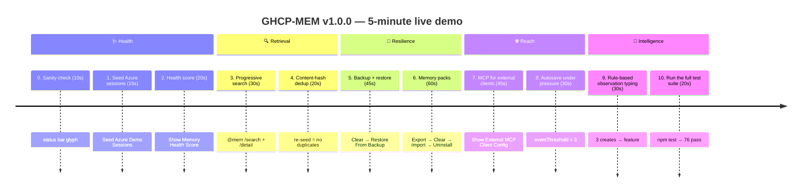
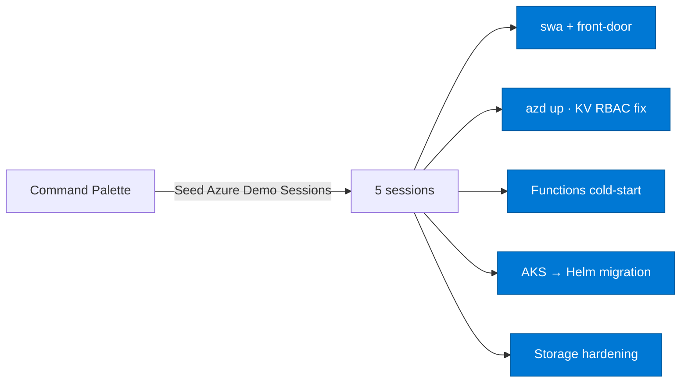
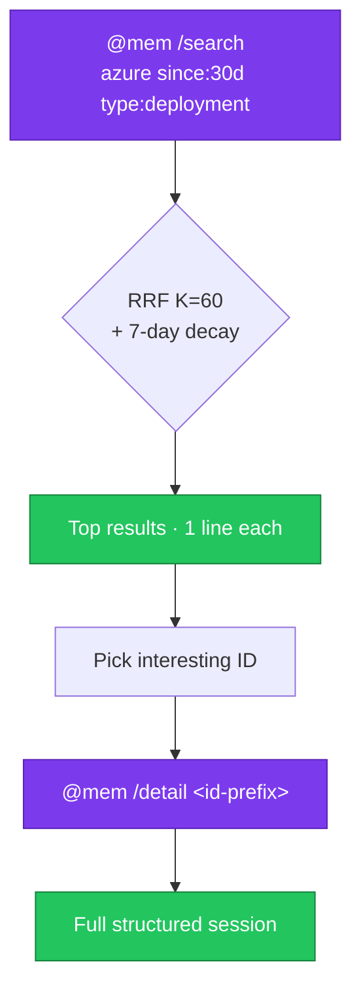
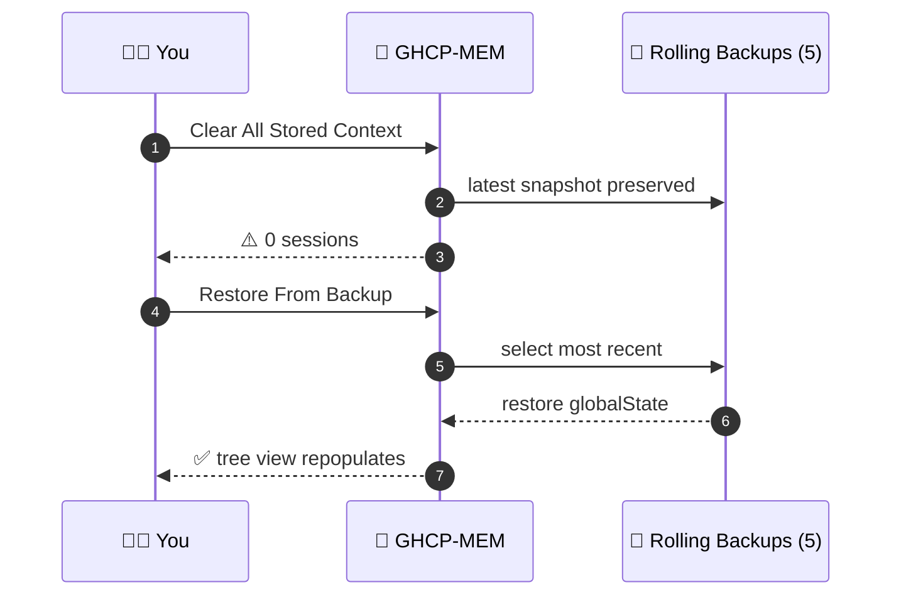
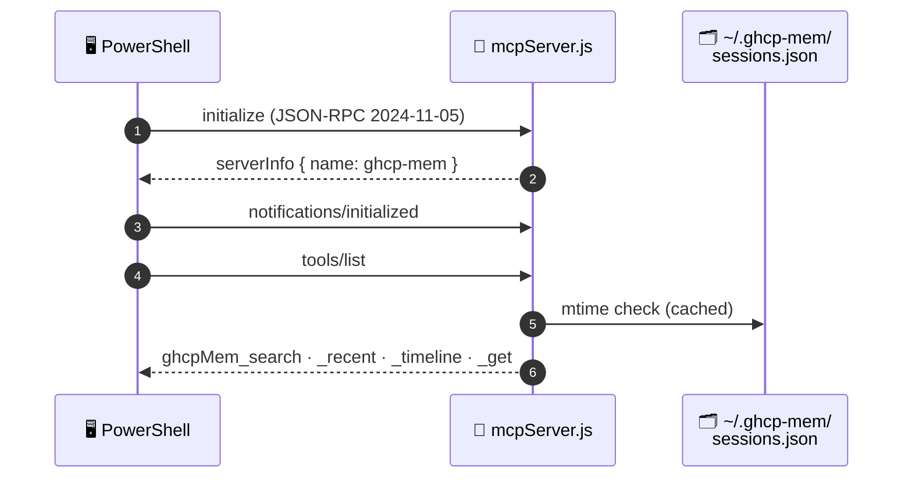

<div align="center">

# 🎬 GHCP-MEM v1.0.0 — Live Demo

### A 5-minute walkthrough that exercises every v1.0.0 capability

[](#)
[](#)
[](#)

</div>

> [!NOTE]
> **Prereqs:** GHCP-MEM v1.0.0 installed and VS Code reloaded. Open any workspace. No Azure subscription needed.

---

## 🗺️ Demo Roadmap



| Section | Steps | Total |
|---|---|---|
| 🩺 **Health & Setup** | 0 → 2 | ~45 s |
| 🔍 **Retrieval** | 3 → 4 | ~50 s |
| 💾 **Resilience** | 5 → 6 | ~105 s |
| 🌐 **Reach** | 7 → 8 | ~75 s |
| 🧠 **Intelligence** | 9 → 10 | ~50 s |

---

## 0. Sanity check (10 sec)

Look at the **status bar bottom-right**:

```
$(history) MEM ●●○○○ 42
```

| Token | Meaning |
|---|---|
| `MEM` | extension is alive |
| `●●○○○` | how full memory is (vs `maxStoredSessions`) |
| `42` | 0–100 health score |

Hover it → tooltip shows session counts + pending events + redactions.

> [!TIP]
> **What this demonstrates:** P4 status-bar health glyph + score.

---

## 1. Seed the demo store (15 sec)

Press `Ctrl+Shift+P` → run **`GHCP-MEM: Seed Azure Demo Sessions`** → click **Seed**.

You now have 5 realistic Azure sessions tagged `demo`. They'll show up in the **GHCP-MEM Sessions** tree view in the Activity Bar.



---

## 2. Memory health score (20 sec)

- `Ctrl+Shift+P` → **`GHCP-MEM: Show Memory Health Score`**
- A markdown doc opens with:
  - 🎯 Overall score (0–100) and density glyph
  - 🔒 Redaction coverage %, typed %, tagged %
  - 🧬 Dedup ratio, retention headroom
  - 📝 Notes (e.g. *"X% sessions have no observation type"*)

**Or** in chat: `@mem /health`.

> [!TIP]
> **What this demonstrates:** P4 analytics gap closed (item #9).

---

## 3. Progressive-disclosure search with inline filters (30 sec)

In Copilot Chat:

```text
@mem /search azure since:30d type:deployment
```

Then drill into one with:

```text
@mem /detail <id-prefix>
```



> [!TIP]
> **What this demonstrates:** RRF + 7-day recency decay (P1 item #2) ranking the deployment-typed Azure sessions; inline filters still working.

---

## 4. Content-hash dedup (20 sec)

- Run **`GHCP-MEM: Seed Azure Demo Sessions`** **a second time**.
- Notice: the tree view does **not** double — duplicates with the same content hash are silently skipped.
- Confirm in chat: `@mem /status` — total session count is unchanged.

> [!TIP]
> **What this demonstrates:** SHA-256 dedup (P0 item #3).

---

## 5. Rolling backups + restore (45 sec)



- Run **`GHCP-MEM: Clear All Stored Context`** → confirm. (All sessions gone.)
- Run **`GHCP-MEM: Restore From Backup`** → pick the most recent backup → confirm.
- Tree view repopulates instantly.

> [!TIP]
> **What this demonstrates:** P0 item #6 — recovery from accidental wipe.

---

## 6. Memory packs (team sharing) (60 sec)

<details open>
<summary><b>📦 Full pack lifecycle: Export → Clear → Import → Uninstall</b></summary>

**Export:**

1. `Ctrl+Shift+P` → **`GHCP-MEM: Export Memory Pack...`**
2. Pack name: `azure-demo`
3. Description: `Realistic Azure sessions for onboarding`
4. Filter: **By tag** → enter `demo`
5. Save dialog → save as `azure-demo.ghcpmem-pack.json` somewhere.

**Re-import:**

1. **`GHCP-MEM: Clear All Stored Context`** → confirm.
2. **`GHCP-MEM: Import Memory Pack...`** → pick the file → confirm modal.
3. Tree view shows the imported sessions, each tagged `pack:azure-demo`.

**Uninstall:**

1. **`GHCP-MEM: Uninstall Memory Pack...`** → pick `azure-demo` → confirm.
2. All 5 sessions gone (untagged sessions, if any, are untouched).

</details>

> [!TIP]
> **What this demonstrates:** P3 item #5 — full pack lifecycle, schema-versioned, auto-redacted on export.

---

## 7. External MCP client (Cursor/Cline/Windsurf/Claude Desktop) (45 sec)

1. `Ctrl+Shift+P` → **`GHCP-MEM: Show External MCP Client Config`**
2. A markdown doc opens with:
   - 🗂️ The store mirror path: `~/.ghcp-mem/sessions.json`
   - 📡 The bundled stdio server path: `<extension>/out/mcpServer.js`
   - 📋 Copy-pasteable `mcp.json` snippets for Cursor / Cline / Windsurf / Claude Desktop



**Quick verification** (PowerShell, no other client needed):

```powershell
# Resolve the bundled MCP server path for whichever version is installed
$mcp = (Get-ChildItem "$env:USERPROFILE\.vscode\extensions\*ghcp-mem*\out\mcpServer.js" | Select-Object -First 1).FullName
'{"jsonrpc":"2.0","id":1,"method":"initialize","params":{"protocolVersion":"2024-11-05","capabilities":{},"clientInfo":{"name":"demo","version":"1"}}}' |
  node $mcp
```

You'll get back a JSON-RPC response advertising the `ghcp-mem` server.

Now list tools:

```powershell
@'
{"jsonrpc":"2.0","id":1,"method":"initialize","params":{"protocolVersion":"2024-11-05","capabilities":{},"clientInfo":{"name":"d","version":"1"}}}
{"jsonrpc":"2.0","method":"notifications/initialized"}
{"jsonrpc":"2.0","id":2,"method":"tools/list"}
'@ | node $mcp
```

Returns the 4-tool catalog: `ghcpMem_search`, `ghcpMem_recent`, `ghcpMem_timeline`, `ghcpMem_get`.

> [!TIP]
> **What this demonstrates:** P3 item #8 — Copilot-only is gone; any MCP client can read the store.

---

## 8. Autosave under "context pressure" (30 sec)

The autosave fires when buffered events exceed the threshold (default 40) **or** wall-clock minutes since last flush exceed the threshold (default 20).

To force it without waiting:

1. Open settings → search `ghcpMem.autosave.eventThreshold` → set to `3`.
2. Edit any 3 files (or save 3 times). The status bar pending-events tooltip increments, then a snapshot fires.
3. Reset the setting to `40` afterwards.

> [!TIP]
> **What this demonstrates:** P2 item #4 — guarantees no unfinished session is lost to a crash.

---

## 9. Rule-based observation typing (visual proof) (30 sec)

The rule classifier runs **before** the LM. Quickest way to see it:

1. Create three files: `src/feature/a.ts`, `src/feature/b.ts`, `src/feature/c.ts` with any content.
2. Run **`GHCP-MEM: Capture Session Snapshot Now`**.
3. Open the new session in the tree → its `observationType` is `feature` (3+ creates rule), even if the LM is offline.

<details>
<summary><b>🏷️ Other rules to try</b></summary>

| Signal | Resulting type |
|---|---|
| Touch only `*.test.ts` | `test` |
| Edit only `README.md` | `docs` |
| Edit only `package.json` / `tsconfig.json` | `config` |
| Run `git revert HEAD` | `bugfix` |
| Edit `.bicep` / `.tf` files | `infra` |
| Run `azd up` / `az deployment` | `deployment` |

</details>

> [!TIP]
> **What this demonstrates:** P2 item — smarter typing than the previous create>edit/diag>edit heuristics.

---

## 10. Run the full test suite (20 sec)

Terminal (from the repo root):

```powershell
npm test
```

You should see **76 tests pass**, covering: redactor, contextStore, types, azureDetect, ruleClassifier, health, packs, autosave, mcpServer.

```
ℹ tests 76
ℹ pass 76
ℹ fail 0
```

> [!TIP]
> **What this demonstrates:** P0 item #7 — formal test coverage.

---

## 🎴 Recap card (paste into your demo slide)

<div align="center">

| # | Capability | One-line proof |
|---|---|---|
| 1 | 🩺 Health score | Status bar shows `MEM ●●○○○ 73` |
| 2 | 💬 `/health` chat command | `@mem /health` returns scored breakdown |
| 3 | 🔍 RRF + recency search | `@mem /search ... since:30d type:X` |
| 4 | 🧬 Dedup | Re-seed demo → tree count unchanged |
| 5 | 🔄 Backups | Clear → Restore From Backup → restored |
| 6 | 📦 Packs | Export → Clear → Import → Uninstall |
| 7 | 🔌 MCP | `node out/mcpServer.js` → JSON-RPC ack |
| 8 | 🪫 Autosave | Lower threshold → edit 3 files → snapshot fires |
| 9 | 🏷️ Rule classifier | 3 creates → typed `feature` automatically |
| 10 | ✅ Tests | `npm test` → **76 pass** |

</div>

> [!IMPORTANT]
> All 9 items in the original [COMPARISON.md](COMPARISON.md) "Where GHCP-MEM is behind" section are now demonstrable in under 5 minutes.

---

<div align="center">

[← Back to README](../README.md) · [Competitive analysis](COMPARISON.md) · [Report an issue](https://github.com/Oluseyi-Kofoworola/ghcp-mem/issues)

<sub>**Demo script for GHCP-MEM v1.0.0** · 76 tests · zero native deps · zero ports</sub>

</div>
