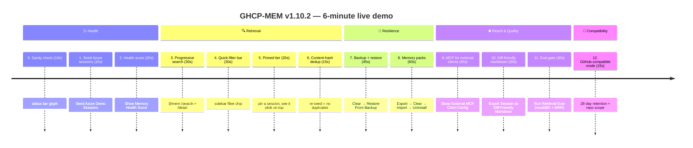
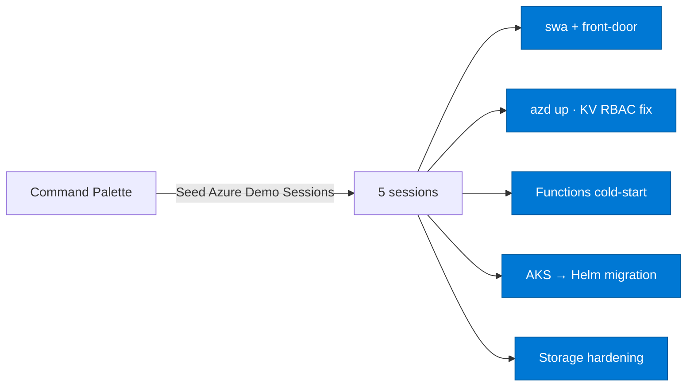
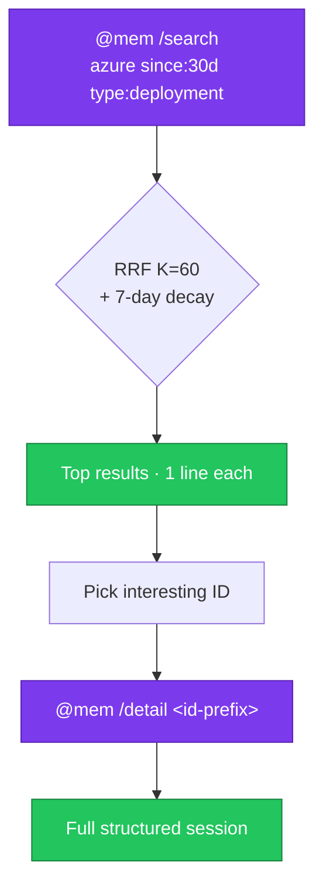
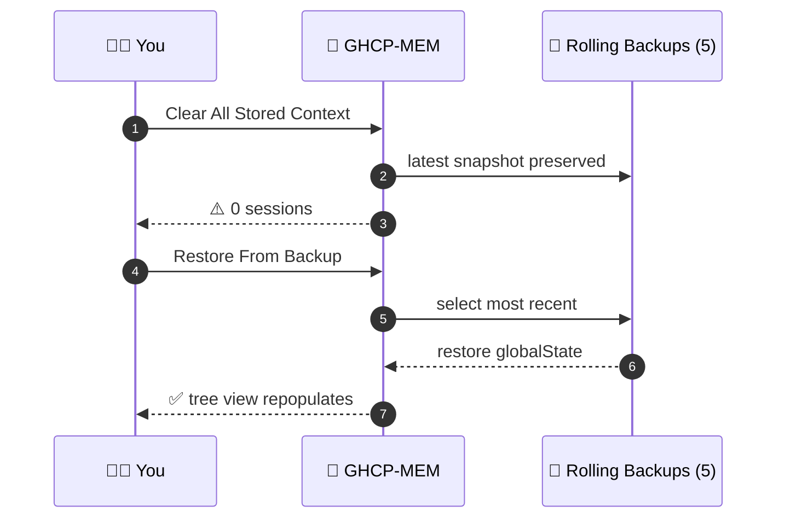
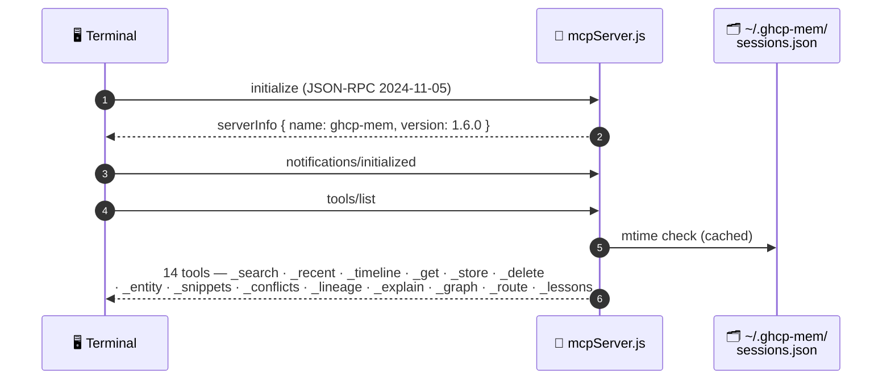

<div align="center">

# 🎬 GHCP-MEM v1.10.2 — Live Demo

### A 6-minute walkthrough that exercises every capability

[](#)
[](#)
[](#)

</div>

> [!NOTE]
> **Prereqs:** GHCP-MEM v1.10.2 installed (Marketplace search **GHCP-MEM**, or `code --install-extension ITcredibl.ghcp-mem`) and VS Code reloaded. Open any workspace. No Azure subscription needed — the Azure steps degrade gracefully if `az` isn't installed or signed in.

---

## 🗺️ Demo Roadmap



| Section | Steps | Total |
|---|---|---|
| 🩺 **Health & Setup** | 0 → 2 | ~45 s |
| 🔍 **Retrieval** | 3 → 6 | ~95 s |
| 💾 **Resilience** | 7 → 8 | ~105 s |
| 🌐 **Reach & Quality** | 9 → 11 | ~105 s |
| 🧠 **Compatibility** | 12 | ~15 s |

---

## 0. Sanity check (10 sec)

Look at the **status bar bottom-right**:

```
$(history) MEM ●●○○○ 42
```

| Token | Meaning |
|---|---|
| `MEM` | extension is alive |
| `●●○○○` | how full memory is (vs `maxStoredSessions`) |
| `42` | 0–100 health score |

Hover it → tooltip shows session counts + pending events + redactions.

---

## 1. Seed the demo store (15 sec)

Press `Ctrl+Shift+P` (or `Cmd+Shift+P`) → run **`GHCP-MEM: Seed Azure Demo Sessions`** → click **Seed**.

You now have 5 realistic Azure sessions tagged `demo`. They'll show up in the **GHCP-MEM Sessions** tree view in the Activity Bar.



---

## 2. Memory health score (20 sec)

- `Ctrl+Shift+P` → **`GHCP-MEM: Show Memory Health Score`**
- A markdown doc opens with:
  - 🎯 Overall score (0–100) and density glyph
  - 🔒 Redaction coverage %, typed %, tagged %
  - 🧬 Dedup ratio, retention headroom
  - 📝 Notes (e.g. *"X% sessions have no observation type"*)

**Or** in chat: `@mem /health`.

---

## 3. Progressive-disclosure search with inline filters (30 sec)

In Copilot Chat:

```text
@mem /search azure since:30d type:deployment
```

Then drill into one with:

```text
@mem /detail <id-prefix>
```



> [!TIP]
> **What this demonstrates:** RRF fusion (keyword + recency + embeddings when available) + 7-day exponential recency decay, with inline filters parsed from the query.

---

## 4. Quick-filter bar (30 sec)

In the Sessions sidebar, click the funnel icon → **`GHCP-MEM: Filter Sessions...`**.

Pick any combination of:
- **Scope**: `workspace` / `repo` / `all`
- **Type**: `feature` / `bugfix` / `infra` / …
- **Tag**: `demo` / `azure` / your tag
- **Last N days** (free-text)
- **Free-text query**

The active filter shows as a clickable chip in the tree header. Click the chip (or run **`GHCP-MEM: Clear Filter`**) to reset.

> [!TIP]
> **What this demonstrates:** the quick-filter bar lets you slice 1000s of sessions in seconds without leaving the sidebar.

---

## 5. Pinned tier (20 sec)

Right-click any session in the tree → **Pin/Unpin Session** (or run `GHCP-MEM: Pin/Unpin Session`).

Pinned sessions sort to the top of the tree under a 📌 group, and they get extra weight in the auto-injected startup-context brief.

> [!TIP]
> **What this demonstrates:** decision-bearing or reference sessions stay visible across the noise of day-to-day capture.

---

## 6. Content-hash dedup (15 sec)

- Run **`GHCP-MEM: Seed Azure Demo Sessions`** **a second time**.
- Notice: the tree view does **not** double — duplicates with the same SHA-256 content hash are silently skipped.
- Confirm in chat: `@mem /status` — total session count is unchanged.

---

## 7. Rolling backups + restore (45 sec)



- Run **`GHCP-MEM: Clear All Stored Context`** → confirm. (All sessions gone.)
- Run **`GHCP-MEM: Restore From Backup`** → pick the most recent backup → confirm.
- Tree view repopulates instantly.

---

## 8. Memory packs (team sharing) (60 sec)

<details open>
<summary><b>📦 Full pack lifecycle: Export → Clear → Import → Uninstall</b></summary>

**Export:**

1. `Ctrl+Shift+P` → **`GHCP-MEM: Export Memory Pack...`**
2. Pack name: `azure-demo`
3. Description: `Realistic Azure sessions for onboarding`
4. Filter: **By tag** → enter `demo`
5. Save dialog → save as `azure-demo.ghcpmem-pack.json` somewhere.

**Re-import:**

1. **`GHCP-MEM: Clear All Stored Context`** → confirm.
2. **`GHCP-MEM: Import Memory Pack...`** → pick the file → confirm modal.
3. Tree view shows the imported sessions, each tagged `pack:azure-demo`.

**Uninstall:**

1. **`GHCP-MEM: Uninstall Memory Pack...`** → pick `azure-demo` → confirm.
2. All 5 sessions gone (untagged sessions, if any, are untouched).

</details>

> [!TIP]
> **What this demonstrates:** schema-versioned packs that are auto-redacted on export _and_ re-redacted on import (defense-in-depth for third-party packs).

---

## 9. External MCP client (Cursor/Cline/Windsurf/Claude Desktop) (45 sec)

1. `Ctrl+Shift+P` → **`GHCP-MEM: Show External MCP Client Config`**
2. A markdown doc opens with:
   - 🗂️ The store mirror path: `~/.ghcp-mem/sessions.json`
   - 📡 The bundled stdio server path: `<extension>/out/mcpServer.js`
   - 📋 Copy-pasteable `mcp.json` snippets for Cursor / Cline / Windsurf / Claude Desktop



**Quick verification** (POSIX shell, no other client needed):

```bash
mcp="$(find ~/.vscode/extensions -name 'mcpServer.js' -path '*ghcp-mem*' | head -1)"
{
  echo '{"jsonrpc":"2.0","id":1,"method":"initialize","params":{"protocolVersion":"2024-11-05","capabilities":{},"clientInfo":{"name":"d","version":"1"}}}'
  echo '{"jsonrpc":"2.0","method":"notifications/initialized"}'
  echo '{"jsonrpc":"2.0","id":2,"method":"tools/list"}'
} | node "$mcp"
```

PowerShell equivalent:

```powershell
$mcp = (Get-ChildItem "$env:USERPROFILE\.vscode\extensions\*ghcp-mem*\out\mcpServer.js" | Select-Object -First 1).FullName
@'
{"jsonrpc":"2.0","id":1,"method":"initialize","params":{"protocolVersion":"2024-11-05","capabilities":{},"clientInfo":{"name":"d","version":"1"}}}
{"jsonrpc":"2.0","method":"notifications/initialized"}
{"jsonrpc":"2.0","id":2,"method":"tools/list"}
'@ | node $mcp
```

Returns the 6-tool catalog: `ghcpMem_search`, `ghcpMem_recent`, `ghcpMem_timeline`, `ghcpMem_get`, `ghcpMem_store`, `ghcpMem_delete`.

> [!TIP]
> **What this demonstrates:** Copilot-only is gone; any MCP client can read the store over a stdio JSON-RPC channel.

---

## 10. Diff-friendly markdown export (30 sec)

Right-click any session in the tree → **Export Session as Diff-Friendly Markdown...** (or run `GHCP-MEM: Export Session as Diff-Friendly Markdown...`). Pick a save location.

Or in chat:

```text
@mem /export <id-prefix>
```

The output is **byte-stable** (sorted arrays, ISO timestamps, deterministic ordering) so committing exports into a repo produces clean diffs across runs.

> [!TIP]
> **What this demonstrates:** version-controllable session memory — diff a session week-over-week, paste into a PR description, or hand off context between teammates.

---

## 11. Retrieval eval gate (30 sec)

`Ctrl+Shift+P` → **`GHCP-MEM: Run Retrieval Eval`**.

A markdown report opens showing **recall@5** and **MRR** for three retrieval configurations:

| Config | What it scores |
|---|---|
| `keyword-only` | Pure `keywordScore()` baseline |
| `hybrid (default)` | RRF + recency + workspace boost |
| `hybrid + freshness` | The above, plus codebase-validation filter |

This is the same suite the CI eval-gate runs (`scripts/eval-check.js`) — and the CI fails the build if recall drops > 5% from the pinned baseline.

> [!TIP]
> **What this demonstrates:** retrieval quality is measured, not assumed. Tweaks to weights, RRF, or freshness are gated on the baseline.

---

## 12. GitHub-compatible mode (15 sec)

Open Settings → search `ghcpMem.githubCompatibleMode` → toggle **on**.

Effective changes:
- `retentionDays` is pinned to `28` (overrides whatever you have set)
- `scope` is forced to `repo` (overrides `user` / `workspace`)

This mirrors the contract of the cloud-hosted [GitHub Copilot Memory](https://docs.github.com/en/copilot/concepts/agents/copilot-memory) preview, so users moving between the cloud agent and the local IDE see consistent behaviour.

> [!TIP]
> **What this demonstrates:** parity-mode for Pro users who also use Copilot Memory in the cloud — same retention, same scope, no surprises.

---

## ✅ Run the full test suite (anytime)

Terminal (from the repo root):

```bash
npm test
```

You should see **138 tests pass**, covering: redactor + redactor-corpus, contextStore, types, azureDetect, ruleClassifier, health, packs, autosave, mcpServer + mcpServer schema, eval, validator, repoScope, markdownExport, contextCompressor, integration.

```
ℹ tests 138
ℹ pass 138
ℹ fail 0
```

Plus the CI pipeline runs three additional gates: `npm run lint` → `npm test` → `node scripts/eval-check.js` → `node scripts/bench-search.js` → `node scripts/smoke.js` → `npm run bundle:prod` → `vsce package`. All on **ubuntu × windows × node 20**.

---

## 🎴 Recap card (paste into your demo slide)

<div align="center">

| # | Capability | One-line proof |
|---|---|---|
| 1 | 🩺 Health score | Status bar shows `MEM ●●○○○ 73` |
| 2 | 💬 `/health` chat command | `@mem /health` returns scored breakdown |
| 3 | 🔍 RRF + recency search | `@mem /search ... since:30d type:X` |
| 4 | 🪟 Quick-filter bar | Sidebar funnel → scope/type/tag/days/text chip |
| 5 | 📌 Pinned tier | Pin a session → it sticks on top + boosts startup brief |
| 6 | 🧬 Dedup | Re-seed demo → tree count unchanged |
| 7 | 🔄 Backups | Clear → Restore From Backup → restored |
| 8 | 📦 Packs | Export → Clear → Import → Uninstall |
| 9 | 🔌 MCP | `node out/mcpServer.js` → JSON-RPC ack |
| 10 | 📝 Diff-friendly export | `@mem /export <id>` → byte-stable markdown |
| 11 | 📊 Eval gate | `Run Retrieval Eval` → recall@5 + MRR table |
| 12 | 🤝 GitHub-compatible mode | `githubCompatibleMode: true` → 28d + repo scope |

</div>

> [!IMPORTANT]
> All features are demonstrable in under 6 minutes. Compare against the [GitHub Copilot Memory](https://docs.github.com/en/copilot/concepts/agents/copilot-memory) cloud preview in [COMPARISON.md](COMPARISON.md).

---

<div align="center">

[← Back to README](../README.md) · [Competitive analysis](COMPARISON.md) · [Report an issue](https://github.com/ITcredibl/ghcp-mem/issues)

<sub>**Demo script for GHCP-MEM v1.10.2** · 386 tests · zero native deps · zero ports · CI ubuntu × windows × node 20 · `npm audit` 0 vulns · Prettier-gated</sub>

</div>
